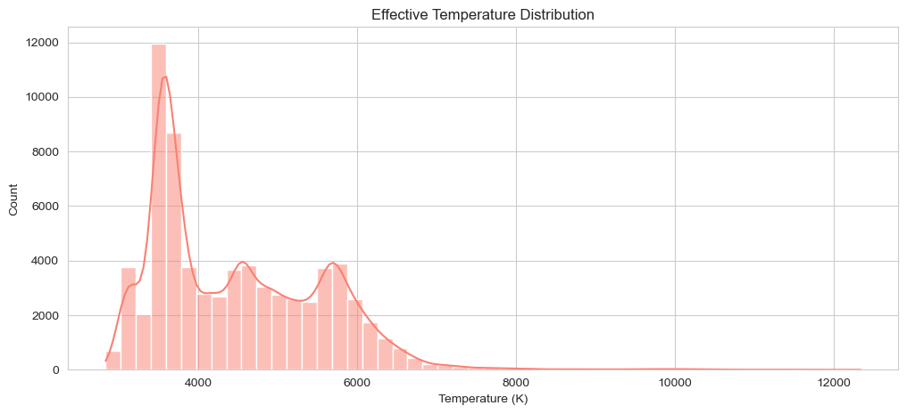
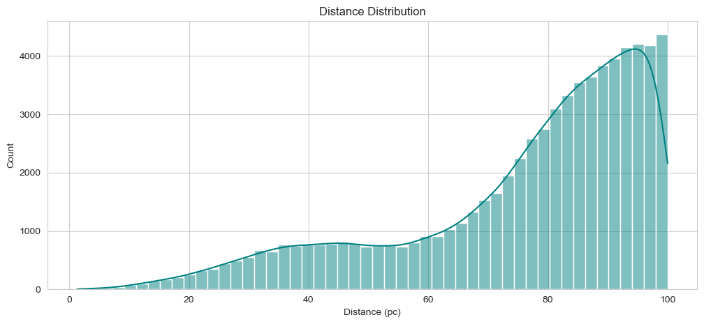
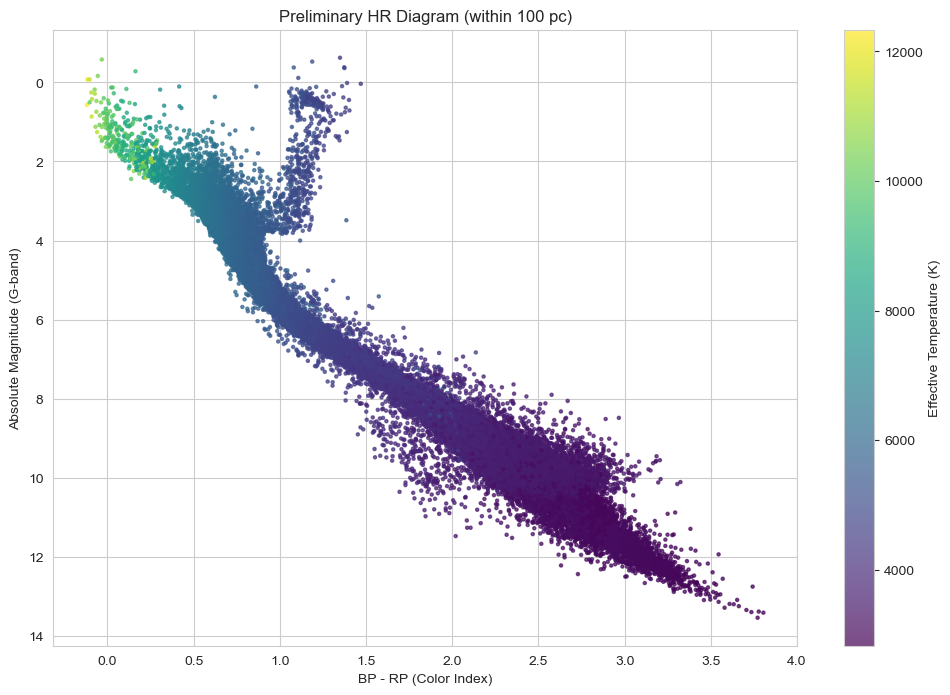
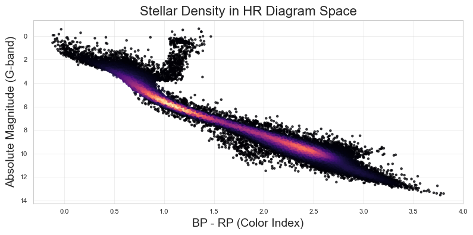
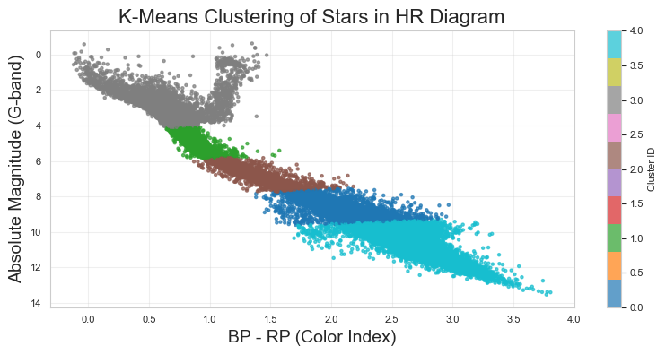
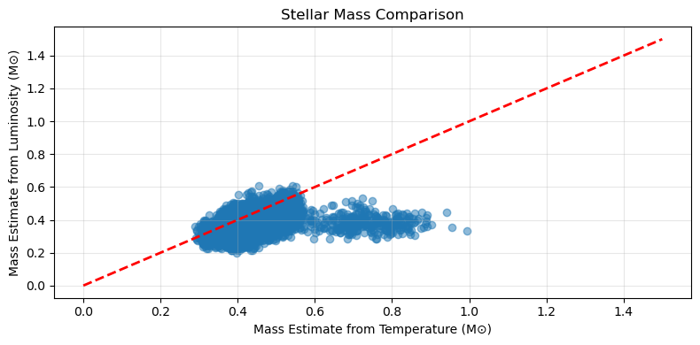
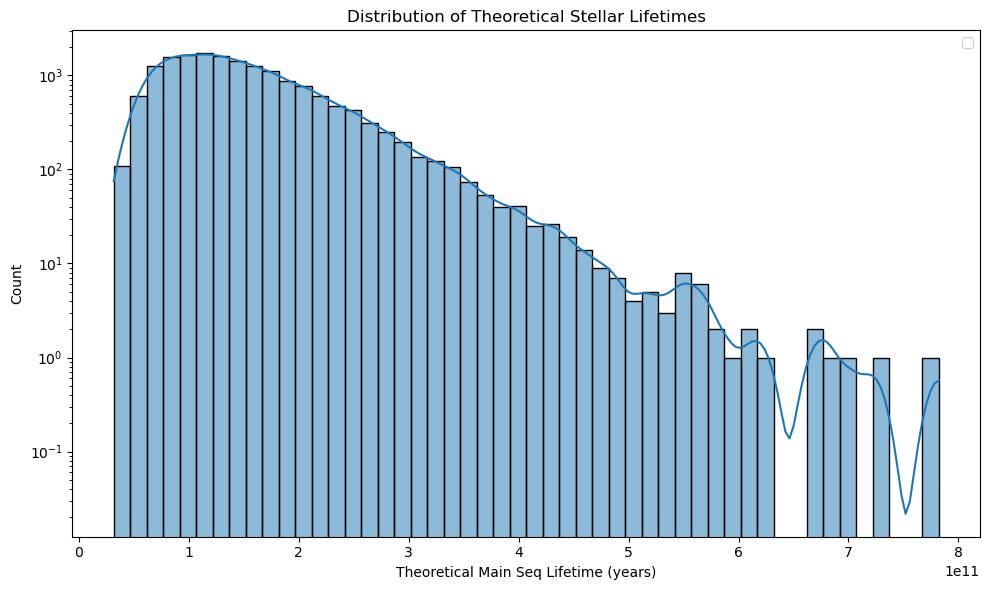
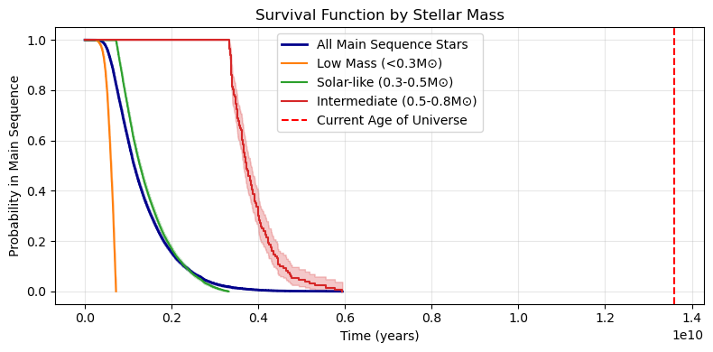
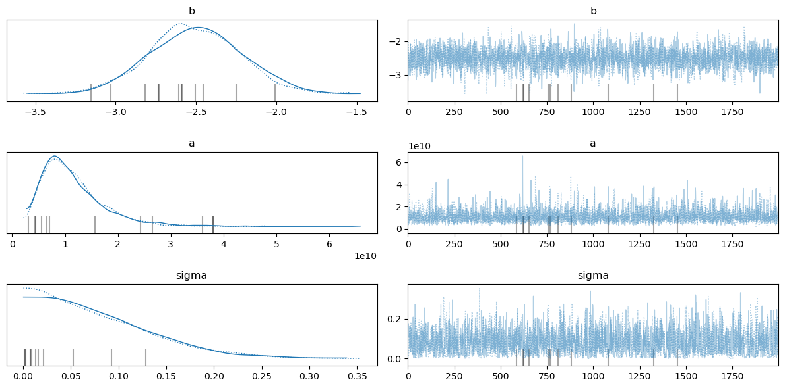

# Statistical Modeling of Stellar Evolution with Gaia Data

> *"The stars are not for the models alone, but for the data that shapes them."*

This project builds **data-driven models of stellar evolution** using **Gaia DR3** and modern statistical methods — survival analysis, clustering, and Bayesian inference — to test one of astrophysics’ oldest predictions: that more massive stars die younger.

## 1. Introduction and Motivation 🦕

### 1.1 Project Rationale 🧠

Stellar evolution theory has long been guided by physical models derived from stellar structure equations and nuclear physics. While powerful, these models often rely on simplifying assumptions—about convection, mass loss, metallicity, and binary interactions—that are difficult to test observationally at scale.

**Gaia**: a revolutionary space observatory providing astrometric, photometric, and spectroscopic data for over **1.8 billion stars**. With parallaxes, proper motions, and multi-band photometry, Gaia enables us to construct detailed Hertzsprung-Russell (HR) diagrams with unprecedented accuracy and sample size.

This project leverages this wealth of data to:

- **Build empirical models** of stellar evolution stages,
- **Validate theoretical predictions**—like the mass-lifetime relation—using rigorous statistical methods,
- And create a **fully reproducible pipeline** that connects raw Gaia queries to publication-ready figures and inference.

### 1.2 Core Objectives 💡

The project is structured around four key goals:

1. **Construct a clean, reliable stellar catalog** from Gaia DR3, applying astrometric and photometric quality cuts.
2. **Classify stars into evolutionary phases** (e.g., pre-main-sequence, main sequence, red giant, white dwarf) using unsupervised clustering techniques (e.g., Gaussian Mixture Models, DBSCAN).
3. **Model main-sequence lifetimes** using survival analysis, treating the transition off the main sequence as an "event time" problem.
4. **Validate the theoretical mass-lifetime relation** via Bayesian hierarchical modeling, quantifying uncertainties and deviations from canonical power laws.

---

## 2. Data Acquisition and Preprocessing 📊

### 2.1 Data Collection

This project is built on high-precision astrometric and photometric data from **Gaia Data Release 3 (DR3)**, accessed via the [Gaia Archive](https://gea.esac.esa.int/archive/) using the `astroquery` Python package. 

| Column               | Description                                                                 | Project Relevance                                                                 |
|----------------------|-----------------------------------------------------------------------------|-----------------------------------------------------------------------------------|
| `ra`, `dec`          | Right Ascension and Declination (sky coordinates in degrees).              | Spatial mapping of stars for cluster identification.                              |
| `parallax`           | Parallax (milliarcseconds). Convert to distance: `distance_pc = 1000/parallax`. | Calculate distances to stars. Critical for luminosity calculations.               |
| `parallax_error`     | Uncertainty in parallax measurement.                                       | Filter stars with reliable distances (`parallax_error/parallax < 0.2`).           |
| `phot_g_mean_mag`    | Apparent magnitude in Gaia’s broad "G" band.                               | Calculate absolute magnitude (`M_G = G - 5 log10(distance) + 5`).                 |
| `phot_bp_mean_mag`   | Blue Photometer (BP) magnitude.                                            | Stellar temperature/color analysis.                                               |
| `phot_rp_mean_mag`   | Red Photometer (RP) magnitude.                                             | Stellar temperature/color analysis.                                               |
| `bp_rp`              | BP - RP color index.                                                       | Proxy for temperature (redder = cooler, bluer = hotter).                          |
| `radial_velocity`    | Line-of-sight velocity (km/s).                                             | Kinematic studies (e.g., Galactic structure, cluster membership).                 |
| `ruwe`               | Renormalized Unit Weight Error (astrometric quality flag).                | Filter high-quality data (`ruwe < 1.4` = reliable positions).                     |
| `teff_gspphot`       | Effective temperature (Kelvin) from Gaia Photometry.                       | Direct input for Hertzsprung-Russell (HR) diagrams and stellar evolution modeling.|
| `phot_variable_flag` | Flag indicating stellar variability.                                       | Identify pulsating stars (e.g., Cepheids, RR Lyrae) for phase classification.     |

### 2.2 Preprocessing Pipeline

Raw Gaia data requires careful cleaning and transformation before scientific analysis. Our preprocessing pipeline consists of the following steps:

#### 📏 Distance Estimation

**Distance estimation** (for $\varpi > 0$):
$$
d\ \text{(pc)} = \frac{1000}{\varpi}
$$

⚠️ *Note:* While more sophisticated Bayesian distance estimators (e.g., [Bailer-Jones 2021](https://ui.adsabs.harvard.edu/abs/2021AJ....161..147B/abstract)) exist, we use the simple inversion here as a baseline, with strict filtering to minimize bias.

#### 🔆 Absolute Magnitude Calculation

$$
M_G = G - 5 \log_{10}(d) + 5
$$

where:
- $ G = \text{phot\_g\_mean\_mag} $
- $ d = \text{distance in parsecs} $

#### 🧹 Quality Filtering

To ensure data reliability, we applied the following cuts:

- Relative parallax error $< 20\%$ ($\sigma_\varpi / \varpi$)
- $2500\ \text{K} < T_{\text{eff}} < 15000\ \text{K}$
- $\text{ruwe} < 1.4$
- Exclude photometrically variable stars

#### ✅ Final Dataset Summary

**Final dataset**:
- Initial: 100,000 stars
- Final: **70,118 stars** (~30% reduction)

> *Figure: Distribution of effective temperatures. Peak at ~5800 K reflects solar-type stars; tail extends to cool M dwarfs and hot A/F stars.*

> *Figure: Distance distribution of the final sample. Majority within 500 pc, with sharp cutoff near 1 kpc due to volume limit.*

---

## 3. HR Diagram and Evolutionary Classification

The Hertzsprung-Russell (HR) diagram is the cornerstone of stellar astrophysics — a plot of luminosity versus temperature (or color) that reveals the evolutionary state of stars. In this section, we construct a high-fidelity HR diagram from our cleaned Gaia DR3 sample and use unsupervised clustering to objectively identify major evolutionary phases.

### 3.1 HR Diagram Construction

We begin by visualizing the classical HR diagram using **absolute G-band magnitude** ($M_G$) on the y-axis (inverted, as standard) and **BP − RP color** as a proxy for effective temperature on the x-axis.

To enhance physical interpretability, the first plot colors each star by its **effective temperature** ($T_{\text{eff}}$) from `teff_gspphot`, using a reversed `viridis` colormap so that **hotter (bluer) stars appear in yellow/blue**, and **cooler (redder) stars in deep red**. A logarithmic normalization ensures balanced color distribution across the wide range of stellar temperatures.

This temperature-colored view clearly reveals major sequences:
- The **main sequence** diagonal stretching from hot, bright blue stars to cool, faint red dwarfs
- A dense **red giant branch** rising vertically from the lower right
- A prominent **horizontal branch** and **asymptotic giant branch**
- A tight sequence of **white dwarfs** in the lower-left corner

In a second visualization, we highlight **stellar density** in the HR diagram using kernel density estimation (KDE). Each point is colored by local point density, revealing regions of high stellar concentration — particularly along the main sequence and red clump — while suppressing noise from sparse or scattered outliers. This "density map" view helps identify natural groupings in the data, guiding our choice of clustering strategy.

> 🔭 **Why This Matters**  
> Unlike theoretical HR diagrams, this is a *data-driven* representation of stellar populations within 1 kpc of the Sun. It reflects real observational biases, completeness limits, and Galactic structure — grounding our analysis in empirical reality.

### 3.2 Clustering Methodology

To move from visual inspection to quantitative classification, we applied **K-means clustering** in the $(BP - RP, M_G)$ plane to group stars into distinct evolutionary populations.

#### Why K-means?

While several clustering algorithms were considered — including **Gaussian Mixture Models (GMM)** and **DBSCAN** — we selected **K-means** for the following reasons:

- **Interpretability**: K-means produces compact, spherical clusters ideal for identifying well-separated sequences like the main sequence, giants, and white dwarfs.
- **Scalability**: With ~70k stars, K-means is computationally efficient and deterministic with fixed initialization.
- **Geometric alignment**: The HR diagram features elongated but relatively convex structures, which K-means can approximate well with sufficient clusters.
- **Reproducibility**: Unlike DBSCAN (sensitive to density variations) or GMM (assumes elliptical distributions), K-means offers stable results across runs when $k$ is well-chosen.

We standardized the features and use the **silhouette analysis** to determine the optimal number of clusters. A value of $k = 5$ provided the best balance between intra-cluster cohesion and astrophysical meaning,aligning with major evolutionary stages.

The resulting clusters were then analyzed for their photometric and physical characteristics to assign evolutionary labels.

### 3.3 Phase Classification Results

The five clusters identified by K-means correspond closely to canonical stellar evolutionary phases. Below is the classification summary:

| Evolutionary Phase | Count | Percentage | Characteristic Features |
|--------------------|-------|------------|--------------------------|
| **Supergiants**     | 18,040 | 25.73% | Highly luminous ($M_G < -1$), cool ($BP - RP > 1.2$), likely massive stars in late stages (e.g., red supergiants or AGB stars) |
| **Main Sequence**   | 16,955 | 24.18% | Forms the diagonal band from upper-left to lower-right; spans $0.2 < BP - RP < 2.5$, representing core hydrogen-burning stars |
| **White Dwarfs**    | 13,799 | 19.68% | Faint ($M_G > 10$) and hot ($BP - RP < 0.5$); concentrated in the lower-left, marking the final stage of low- to intermediate-mass stars |
| **Giants**          | 13,556 | 19.33% | Bright ($-1 < M_G < 3$) and red ($BP - RP > 1.0$); includes red giant branch (RGB) and red clump stars |
| **Subgiants**       | 7,768  | 11.08% | Transition population between main sequence and giants; located in the "hook" region of the HR diagram |

---

## 4. Stellar Lifetime Modeling

### 4.1 Theoretical Foundation

Main-sequence lifetime is set by fuel supply and consumption rate:

$$
\tau_{\text{MS}} \propto \frac{M}{L}, \quad L \propto M^{3.5} \quad \Rightarrow \quad \tau_{\text{MS}} \propto M^{-2.5}
$$

We test this canonical relation using survival modeling and Gaia data.

### 4.2 Mass Estimation

Stellar mass is estimated from photometry using two independent relations:

**From temperature:**
$$
\frac{M}{M_\odot} = \left( \frac{T_{\text{eff}}}{5772} \right)^2
$$

**From luminosity:**
$$
\frac{M}{M_\odot} = \left( \frac{L}{L_\odot} \right)^{1/3.5}, \quad \frac{L}{L_\odot} = 10^{(4.74 - M_G)/2.5}
$$

Observational scatter is modeled via log-normal noise.

> *Figure: Mass estimates from temperature vs. luminosity. Points cluster around the $ y = x $ line, indicating consistency between methods.*

> *Figure: Distribution of theoretical main-sequence lifetimes using $ \tau \propto M^{-2.5} $ with scatter. Most stars have long lifetimes, with a tail toward short-lived massive stars.*

### 4.3 Survival Analysis Framework

#### 4.3.1 Kaplan-Meier Estimator

**Purpose**: Non-parametric estimation of the survival function — the probability that a star remains on the main sequence beyond age $ t $.

The Kaplan-Meier estimator is defined as:

$$
\hat{S}(t) = \prod_{t_i \leq t} \left(1 - \frac{d_i}{n_i}\right)
$$

where $ d_i $ is the number of "events" (leaving the main sequence) at time $ t_i $, and $ n_i $ is the number of stars at risk just before $ t_i $.

🔗 *Original paper*: [Kaplan & Meier (1958), "Nonparametric Estimation from Incomplete Observations"](https://www.jstor.org/stable/2281868)

> *Figure: Kaplan-Meier survival curves for four mass bins. Higher-mass stars show faster decline, indicating shorter main-sequence lifetimes.*

#### 4.3.2 Weibull Accelerated Failure Time (AFT) Model

**Purpose**: Parametric modeling of stellar lifetime as a function of mass and temperature.

The Weibull AFT model assumes:

$$
\log T = \beta_0 + \beta_1 \log M + \beta_2 T_{\text{eff}} + \sigma \epsilon
$$

where $ \epsilon $ follows an extreme value distribution. The coefficient $ \beta_1 $ directly quantifies how mass accelerates or delays evolution off the main sequence.

🔗 *Seminal work*: [Kalbfleisch & Prentice (2002), "The Statistical Analysis of Failure Time Data"](https://onlinelibrary.wiley.com/isbn/9780471363576)

| Parameter       | Value (95% CI)           | Interpretation |
|-----------------|--------------------------|----------------|
| mass ($\beta_1$) | -2.66 (-2.68, -2.64)     | Main-sequence lifetime scales as $ M^{-2.66} $ — slightly steeper than canonical $ M^{-2.5} $ |
| $\lambda$ (scale) | $1.19 \times 10^{10}$ ($1.12 \times 10^{10}$, $1.27 \times 10^{10}$) | Characteristic lifetime near solar mass (~10 Gyr) |
| $\rho$ (shape)    | 1.98 (1.97, 1.99)         | Shape parameter >1 indicates increasing failure rate (more stars leave MS over time) |
| $T_{\text{eff}}$  | 0.00 (0.00, 0.00)         | No significant additional predictive power beyond mass |

**Model Fit**:  
Concordance = 0.92, AIC = 429,318, log-likelihood = -214,655.01  
Likelihood ratio test: $ p \ll 0.005 $ — model is highly significant

#### 4.3.3 Bayesian Power Law Model

**Purpose**: Full probabilistic inference on the mass-lifetime relation, including uncertainty quantification.

We fit a power-law model:

$$
\tau(M) = a \cdot M^b
$$

using **Bayesian hierarchical modeling** with censored likelihoods. The model assumes that true lifetimes follow a log-normal distribution around the predicted value, and uses the observed ages and evolutionary status (on/off main sequence) to constrain $ a $ and $ b $.

Censoring is handled explicitly:
- If a star is still on the main sequence → **right-censored**: $ \tau > \text{age} $
- If it has evolved off → **left-censored**: $ \tau < \text{age} $

We use Markov Chain Monte Carlo (MCMC) to sample the posterior distribution of $ b $, the power-law index.

🔗 *Foundational reference*: [Gelman et al., *Bayesian Data Analysis*](https://www.stat.columbia.edu/~gelman/book/)

> *Figure: Posterior distributions for $ b $, $ a $, and $ \sigma $. The exponent $ b $ centers tightly around $-2.51$, in strong agreement with the canonical $ M^{-2.5} $ relation.*

| Parameter | Mean       | SD         | 95% HDI Lower | 95% HDI Upper |
|---------|------------|------------|---------------|---------------|
| $ b $   | -2.51      | 0.29       | -3.04         | -1.97         |
| $ a $   | $ 1.13 \times 10^{10} $ | $ 6.06 \times 10^9 $ | $ 2.82 \times 10^9 $ | $ 2.26 \times 10^{10} $ |
| $ \sigma $ | 0.079 | 0.060      | 0.000         | 0.184         |

- **Key result**: The inferred exponent $ b = -2.51^{+0.54}_{-0.54} $ (95% HDI) matches the theoretical prediction of $-2.5$ within uncertainty.
- **Convergence**: $ \hat{R} = 1.0 $ for all parameters, and ESS > 1600 confirms reliable sampling.

## 📂 Future Steps
- Clean and preprocess the data.  
- Develop a mathematical model for stellar evolution.  